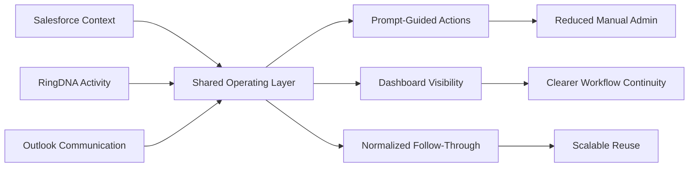

# Architecture Notes | HPE Workflow Automation

## Design Principle

The architecture goal was to create one operating model across multiple systems without forcing a heavy platform replacement effort.

## Core Components

### System Inputs

- Salesforce as the authoritative opportunity and account system
- RingDNA as the activity and engagement layer
- Outlook as the communication continuity layer

### Shared Operating Layer

- dashboard-led workflow visibility
- prompt-engineered task framing
- normalized routing and follow-up logic
- reusable patterns for repeated actions

### Human-Control Principle

Automation was positioned as an assistive layer, not an autonomous substitute for judgment. That matters in pre-sales and sales support because the system has to preserve clarity, trust, and operator confidence.

## Architecture Decisions

1. Keep the user close to the workflow.
   The goal was not a black-box automation chain. It was a guided operating system that reduced friction while keeping intent visible.

2. Standardize prompts around recurring work.
   Prompt engineering was treated as process design. Structured prompts reduced variance and made expertise more reusable.

3. Favor workflow continuity over feature sprawl.
   The most valuable improvement was smoother progression across tools, not a long list of disconnected enhancements.

4. Design for transferability.
   The solution was framed as a reusable pattern so the value could extend beyond one seller motion.

## Simplified Flow

## What Was Deliberately Avoided

- exposing confidential internal implementation details
- over-automating decisions that still need human context
- building a solution that only works for one narrow workflow
